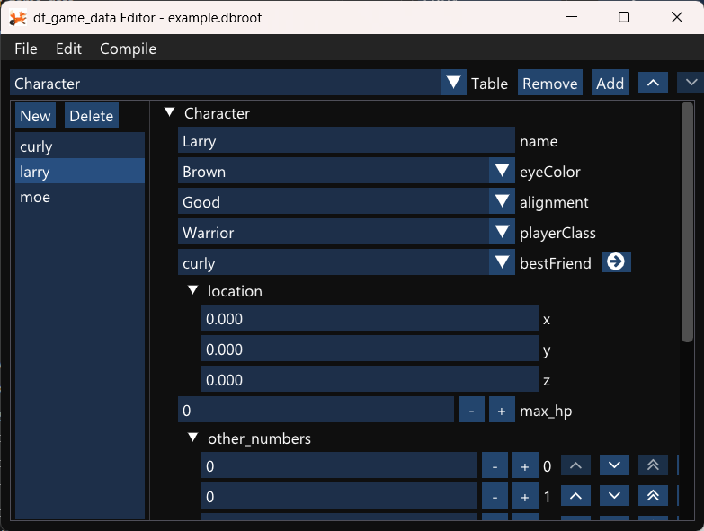

# df_game_data

[](https://github.com/Atrix256/df_game_data/actions/workflows/ci.yml)

Minimalist C++ game data middleware by Alan Wolfe.

Describe schemas, edit data in the editor, binary pack data, load data with a generated header. Hot reloading support.

```cpp
#include <stdio.h>
#include "Data.h" // Header generated during data compilation

int main(int argc, char** argv)
{
    Data data;
    if (!data.LoadFromFile("packed/Data.bin")) // bin file made during data compilation
    {
        printf("Could not load packed/Data.bin\n");
        return 1;
    }

    // get by index
    Data::CharacterRecord char0 = data.GetCharacter(0);

    // get by name
    Data::CharacterRecord char0 = data.GetCharacter("Larry");

    //...

    return 0;
}
```

## Motivation

Nearly every game needs read only configuration data.

An RTS needs to know the stats of units, what buildings can produce what units for what cost, and requirements for unlocking buildings and units.

A role playing game needs to know what items there are, stats for monsters, and what items monsters drop when they are killed, with what probabilities.

An incremental game needs to know what upgrades are available, what unlocks them, and what benefit they give to the player.

The list goes on and on. This need is what this project addresses.

I made it for my own use but it aims to be a solution for people making their own engine, or for people who don't like the solution built into the engine they are using.

I wrote some more about this topic 10 years ago: https://blog.demofox.org/2016/04/01/game-development-needs-data-pipeline-middleware/

## Data Model

A database is the root object and is made up of tables.

A table is an array of entries that can be looked up by name or index.

All entries in a table use the same struct.

struct fields can be:
* bool - true or false
* integers - uint8, int8, uint16, int16, uint32, int32, uint64, int64
* floats - float, double
* string - text
* enum - integers that have labels
* struct - a different struct
* union - a data type that allows a field to be one of a specific list of types. Can be null.
* link - a link to a table entry. Can be null.

Struct fields may also be dynamic or static sized arrays of the above types.

## Use Overview

1. Define A Table
2. Edit Data
3. Compile Database And Use Output

### 1. Define A Table

[Full .def Spec](def.md)

Make a .def file to define a table schema.  This is a C/C++ style definition of types.

```cpp
// Monster.def
#include "common.def"  // defines Vec3 struct

enum Alignment
{
    Good,
    Evil,
    Neutral
};

struct Monster
{
    string name;
    float hp = 20.0;
    Vec3 spawnPosition;
    Alignment alignment = Good;
};

// This table will have entries of the Monster struct
#root Monster
```

### 2. Edit Data

[Editor Details](editor.md)

If you open your .def file in the editor, it will create a .dbroot file automatically.

You can add entries to your table, and you can add other tables to your database.

Each data entry is a .json file on disk, in the same folder as the .def file. In general, you want one folder per .def file.

The data entries are separate files to minimize merge conflicts when merging development branches.

This is what the editor looks like:



### 3. Compile Database And Use Output

[Compilation Details](compiler.md)

Compilation settings can be found under the **Edit** menu, and allows you to configure multiple build targets with different compilation options.

You can compile the database using the **Compile** menu, or by pressing CTRL+C.

Compilation creates a .bin file which is the binary representation of all entries in all tables in your .dbroot file.

It also creates a .h file.  This is a standalone header file which you include in your code to load the .bin file and read data from it.

Here is some code showing how to use the compiled output .bin and .h files:

```cpp
// main.cpp
#include "data.h" // Header generated during data compilation

int main(int argc, char** argv)
{
    Data data;
    if (!data.LoadFromFile("data.bin")) // bin file generated during data compilation
        return 1;

    Data::MonsterRecord kobold = data.GetMonster("kobold");

    // Valid() returns false if a record name or index couldn't be found.
    // Get() returns a const reference to the data object.
    // Invalid objects return default constructed data objects.
    float hitpoints = 0.0f;
    if (kobold.Valid())
        hitpoints = kobold.Get().hp;
    else
        hitpoints = kobold.Get().hp;

    uint32_t monsterCount = data.GetMonsterCount();

    Data::MonsterRecord otherMonster = data.GetMonster(3);

    while(!GameOver())
    {
        PlayGame();

        // Call Tick() for hot reloading.
        // Records auto update after hot reload, but any data you cached from a record
        // will need to be updated manually.
        // Tick returns true when a hot reload happens, so that you can react to it.
        data.Tick();
    }

    return 0;
}
```

## Examples

The `Examples` folder has three examples in it that you can run using the `Examples\Examples.slnx` solution.  Each example also has a data folder where you can see and edit the source data.

1. [Simple](Examples/1_Simple/main.cpp) - This shows how to load a compiled bin file and read data from it.
2. [HotReloading](Examples/2_HotReloading/main.cpp) - This shows how hot reloading works.
3. [Exhaustive](Examples/3_Exhaustive/main.cpp) - This exercises every feature available, and shows how to read the data for each.

## Building

This was developed on windows using microsoft visual studio.  Cloning the repo and building the solution should be all that is needed.

## Contributors

Created by Alan Wolfe

### Contributing

Contributions are most welcome!

Please try to follow the style of code near where you are editing, and test your changes.

The `RunTests.bat` file can be used to quickly make sure things are still working ok.  It runs the three examples in debug and release, and also in x86 (32 bit) and x64 (64 bit). You should run this before making a pull request.

You can add your name to the contributor list in the section above (sorted alphabetically by first name). Any change large
or small earns a spot in the contributor list.

If you are looking for ideas to contribute, the issues list has several todo items.

Regarding AI use - I'd prefer you not use AI. If coding assistants worked as advertised, I wouldn't be able to tell if you were using them though. Test your code, understand your code, be responsible for your code; don't be rude.

## Open Sourced Software Used

Thank you to the creators of the following!

| Software | Use | URL |
| -- | -- | -- |
| Dear ImGui | For editor UI | https://github.com/ocornut/imgui |
| rapidjson | To load json data | https://rapidjson.org/ |
| Font Awesome | Editor button icons | https://github.com/FortAwesome/Font-Awesome |
| xxHash | Portable non crypto hash | https://github.com/cyan4973/xxhash |
