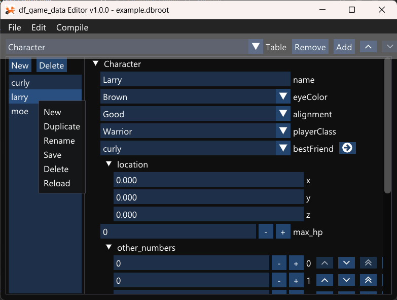
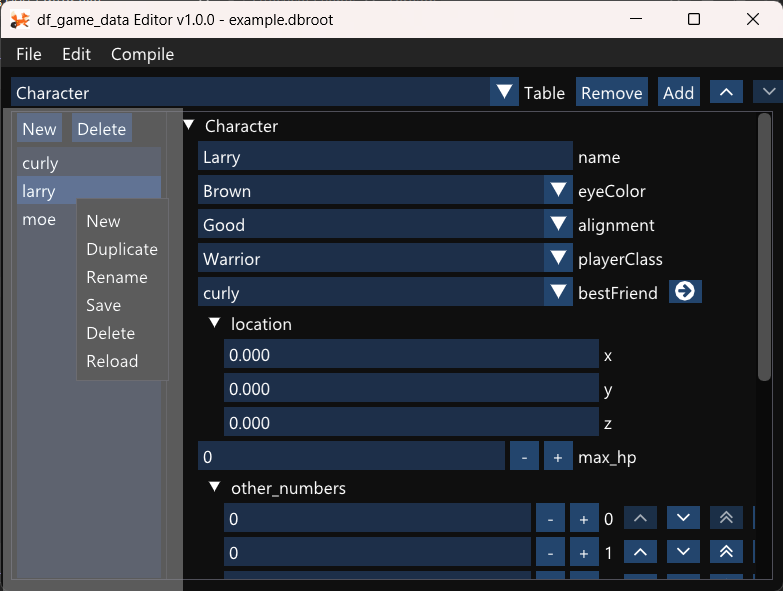
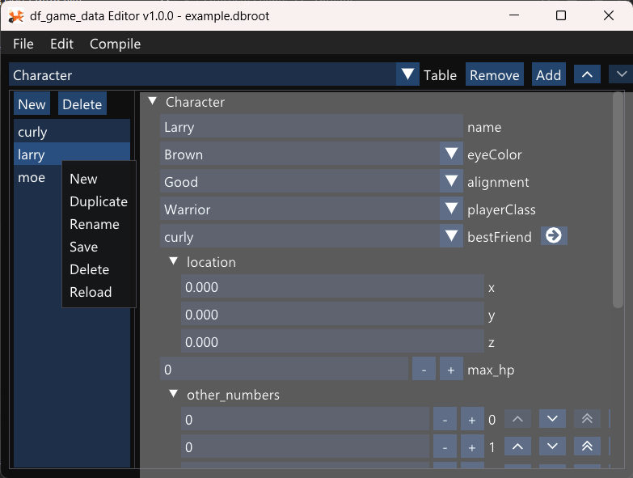
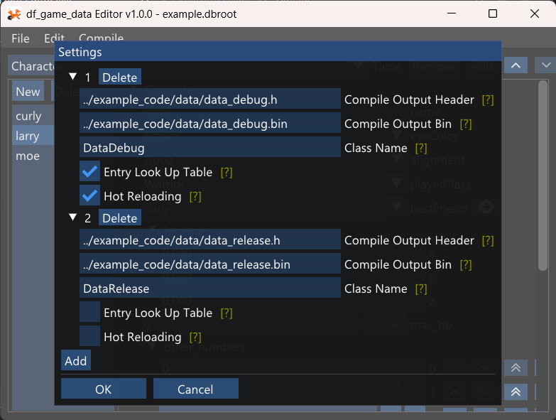

# Editor

The editor is where you edit data, configure compilation settings, and compile the data.

## .dbroot file

When you open a .def file in the editor, it will automatically make a .dbroot file, which has the settings for your database.

This is a json file that contains a list of what tables there are in the dabase, and the compilation options.

Once created, this is the file you want to open in the editor.

## Adding and Removing Tables

The section highlighted below shows where you add a new table to the database, or remove the current table from the database.

The arrow buttons also allow you to move a table up and down in the table list. Table order matters when one table uses types defined by the def files of another table. Type definitions need to come before their use.

## Adding and Removing Data Entries

The section highlighted below shows where you add data entries, remove them, or select them for editing.  You can right click an entry to bring up the context menu shown.

## Editing Data Entries

When a data entry in a table is selected, the right panel lets you edit that data.  An asterisk will show up next to an entry in the entry list when it's modified and different than what is on disk.

The file menu lets you can save an individual data entry or all data entries. You can also use Ctrl+S or Ctrl+A respectively.  Compiling a database also does a "Save All" before compilation.

## Settings

Under the Edit menu is the settings window. This lets you configure an array of compilation settings. When the data is compiled, all configurations are compiled.

Compilation settings let you choose the name and path of the .h and .bin files, and also the name of the class in the header file.

There is a setting for "Entry Look Up Table". This is on by default, but when it's on, it includes a list of the entry names in each table to allow for an entry look up by name. When this is off, that table isn't there and the generated header does not have the interface to look entries up by name.  Having data entry names in the .bin file can make it easier for people to understand where to modify the .bin file to modify the game.  Without the name table, it's a little more obfuscated.

There is also a setting for "Hot Reloading". This is on by default, but if it's turned off, the hot loading functionality will not be in the generated .h file, which makes entry record objects lighter weight.  The Tick() function still exists for convenience, but it only has "return false" in it. Hot reloading requires the entry look up table to be on, and will turn that setting on if it's off, but hot reloading is on.

The settings window is set up this way so that for instance, you could have a data compilation for "debug" mode which included hot reloading, but the "release" mode had hot reloading and the entry LUT turned off.  In release, the binary data file would be a little smaller, not have human readable strings in it saying what the records were, and the runtime would be more efficient.  You would just change which header you included in debug vs release.  That is one possible configuration of many.

## Data Compilation

You can compile the data in the editor under the Compile menu.

You can also compile the data through the editor's command line interface.  Compiling through the command line interface will cause it to compile data without creating a window, and will exit when done, with an exit code of 0 on success.

`Editor.exe <filename>` - Opens the editor and automatically loads the specified filename

`Editor.exe --compile <filename>` - Loads the specified filename and compiles, without creating a window.

`Editor.exe -c <filename>` - same
